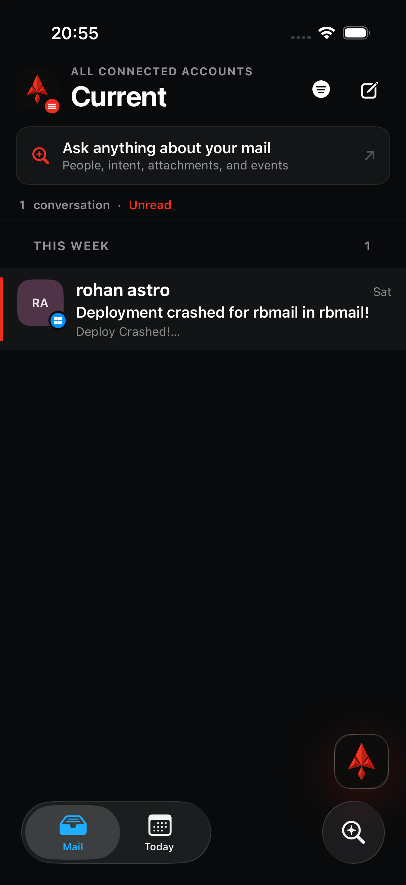
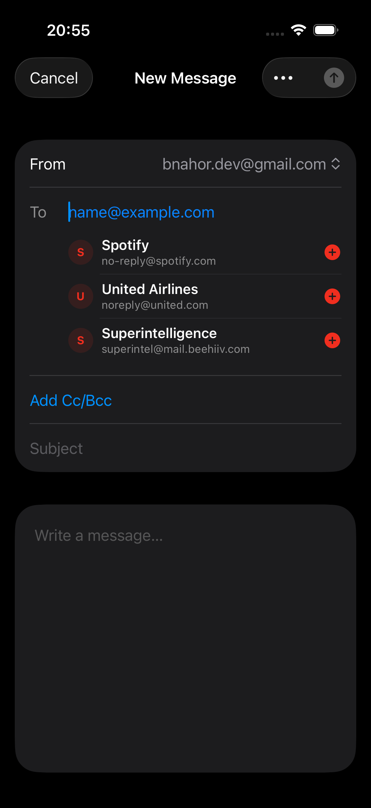

# Rubidium filter and composer audit

Overall health: **ready for device verification**. The broken mailbox routing is corrected end to end, the filter control now exposes explicit mutually exclusive choices, and the composer supplies recent-recipient completion without clipping. The two accepted screenshots below were captured from the current iOS 27 simulator build at 1206 × 2622.

## 1. Active mailbox filter — Healthy

- The active filter is visible in both the filled filter symbol and the `Unread` count label.
- The thread count and sections recompute from the filtered result instead of only changing the control's appearance.
- The filter menu now uses a system `Picker` for All messages, Unread, Flagged, and With attachments.
- Needs Attention, Drafts, Sent, Junk, Archive, Trash, Flagged, VIP, Snoozed, and Gmail labels now map to distinct server filters.
- The selected state remains legible in dark mode and does not collide with the title, compose control, search plane, or tab bar.

## 2. Recipient completion — Healthy

- To, Cc, and Bcc offer deduplicated suggestions from recent conversation participants while excluding the user's connected addresses.
- Suggestions are full-width native rows capped at three visible results, so names and addresses do not clip at the form edge.
- Tapping a result inserts a normalized address and keeps focus in the active recipient field.
- Email-address autocorrection stays disabled to avoid corrupting valid addresses; Subject and Message explicitly enable native autocorrection and sentence capitalization.
- Return advances from To → Cc/Subject → Message instead of dismissing input unexpectedly.

## Verification

- iOS simulator build: passed.
- Web TypeScript check and production build: passed.
- Server tests: 21 passed, including all native mailbox mappings, Needs Attention constraints, default/search behavior, and custom Gmail labels.
- No Railway deployment or production data mutation was performed during this audit.

## Evidence limits

- Screenshots prove layout, visible state, and absence of clipping; they do not prove VoiceOver order, hardware-keyboard behavior, or the quality of Apple's learned autocorrection dictionary.
- The opened filter menu itself was not captured; its selection behavior is covered by the system `Picker` implementation, successful native compilation, and server filter tests.
- Final touch, keyboard, and haptic behavior still needs a short pass on the attached physical iPhone after installation.
