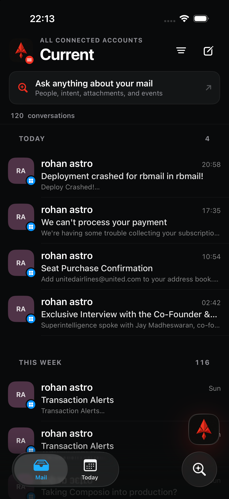
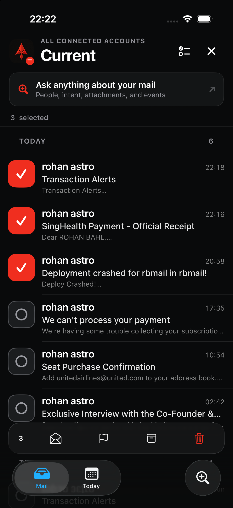
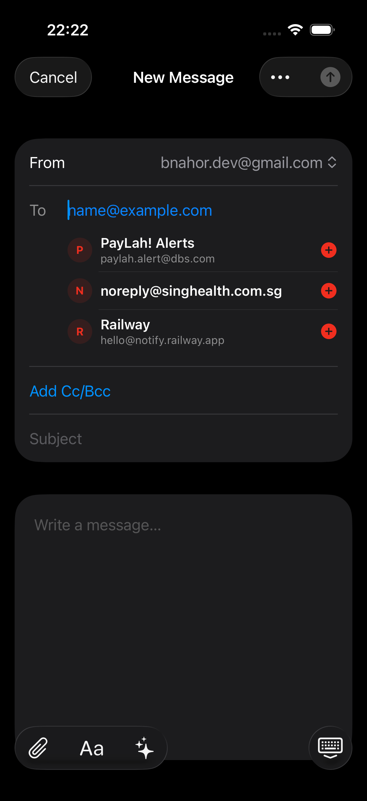

# Rubidium recipient completion and multi-select audit

Run: 10 August 2026, iPhone 17 Pro simulator, iOS 27 beta, dark appearance.

## Outcome

The inbox keeps Rubidium's existing structure and visual identity. The refinement adds two focused capabilities:

1. Recipient completion searches people found anywhere in the signed-in user's synchronized mailbox cache, not only the threads currently visible on screen. Results are deduplicated, exclude the user's connected addresses, rank prefix matches first, then frequent and recent correspondents, and appear as native tappable suggestions in To, CC, and BCC.
2. Multi-select starts by tapping a sender tile or holding a row. Sender tiles become compact selection controls in place, selected rows receive an angular Rubidium check state, swipes are disabled, and the existing bulk-action plane handles Read, Flag, Archive, and Trash. The header offers Select All/Deselect All and Finish only while selection is active.

## Evidence

### 1. Before — discoverability gap

**Health: needs refinement.** The inbox itself is visually coherent, but there is no visible row-level way to enter multi-select. The capability is buried in the filter menu, increasing hunting and making selection feel like a separate mode rather than a direct manipulation of messages.

### 2. After — selection in place

**Health: good.** The mailbox title, search plane, list density, tab controls, and Rubidium identity remain unchanged. Selection state replaces only the controls whose intent changes: sender tiles, the two header actions, the conversation count, and the batch-action strip. Selected and unselected states remain legible without moving message content or adding a second navigation system.

### 3. After — native recipient suggestions

**Health: good.** Suggestions sit directly below the focused recipient field, preserve the existing full-screen composer, expose both display name and address, and provide a large add target. To/CC/BCC use an email keyboard without sentence autocorrection; Subject and Body retain native text correction and completion.

## Interaction rationale

- Outlook mobile establishes the discoverable pattern of tapping the sender circle or holding a message, then tapping additional messages and acting through one batch toolbar: <https://support.microsoft.com/en-us/outlook/how-do-i-select-multiple-emails>
- Apple's list guidance recommends an explicit edit/selection state with clear feedback, while SwiftUI's list-selection model treats selection as a transient interaction mode rather than a second destination: <https://developer.apple.com/design/human-interface-guidelines/lists-and-tables> and <https://developer.apple.com/documentation/swiftui/editmode>
- Rubidium adapts that convention to its own angular sender tiles and existing action plane instead of copying Outlook's layout or replacing the current information architecture.

## Verification

- 24 server unit tests passed, including recipient deduplication, self-address exclusion, matching, ranking, and result limits.
- Web type checking and the optimized production build passed.
- The native SwiftUI target compiled successfully for the iPhone simulator.
- Current-run screenshots were inspected at original resolution for clipping, overlap, safe-area errors, and dark-mode contrast.

## Boundaries

“Mailbox suggestions” means people present in mail that Rubidium has synchronized for the current user. It intentionally does not request Contacts permission and cannot suggest a person who has never appeared in synchronized mail. Provider messages that have not synchronized yet will appear after synchronization. This preserves the requested low-friction behavior without adding a new permission prompt or contact-management surface.
