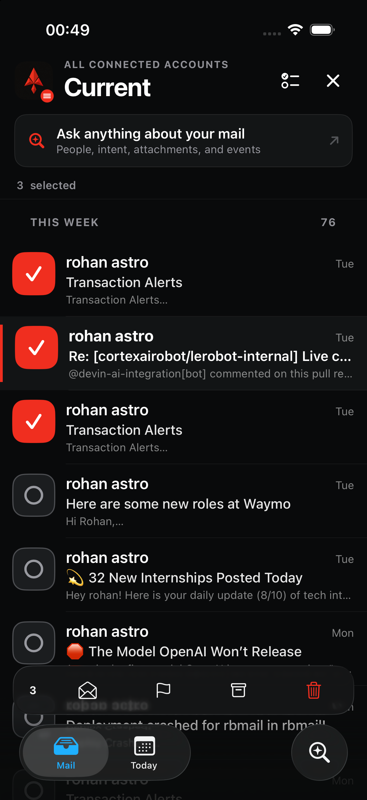
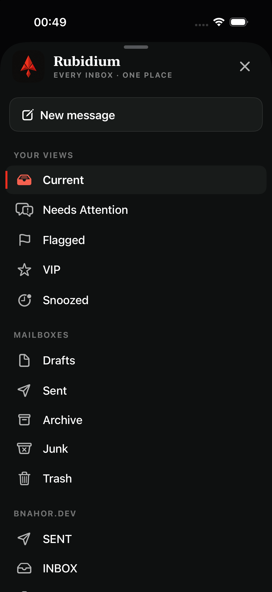
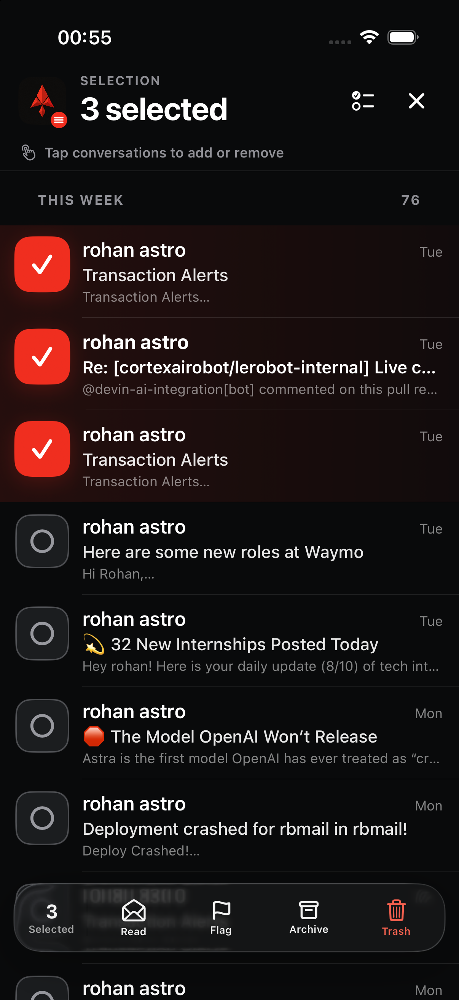
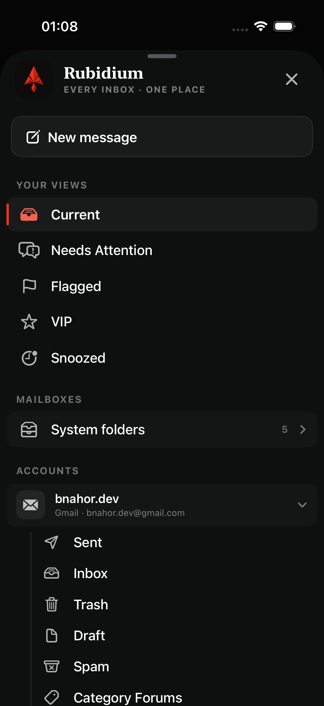
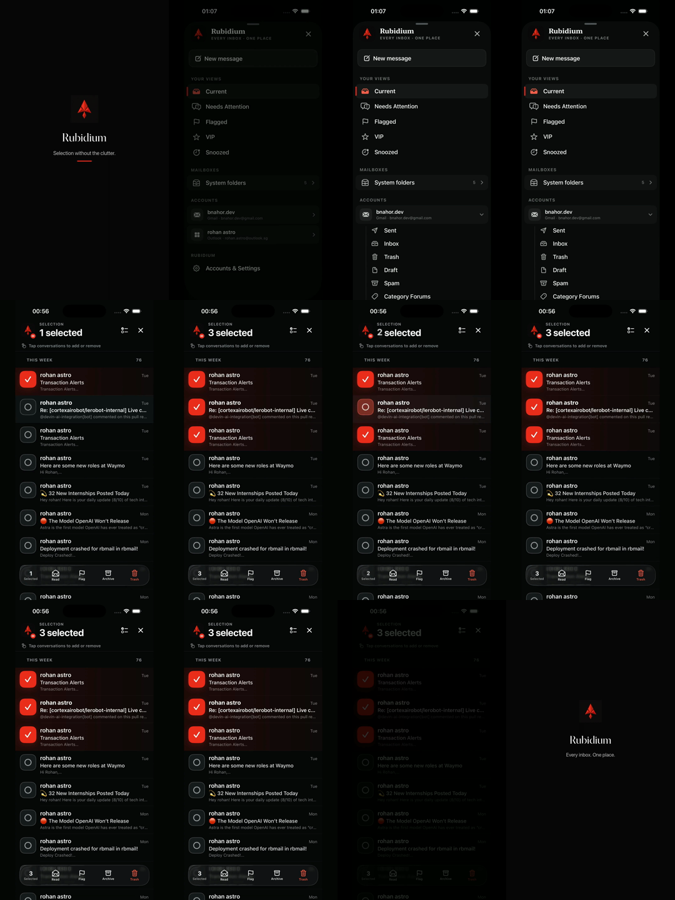

# Rubidium selection and mailbox hierarchy audit

**Run:** 13 August 2026

**Target:** iPhone simulator, iOS 26+, dark appearance

**Scope:** conversation selection, bulk actions, compact mailbox navigation, nested provider folders, motion, and clipping

## Outcome

The revised flow keeps Rubidium's existing visual identity while making selection a clear temporary mode and turning the mailbox menu into a progressively disclosed hierarchy. The persistent tab bar no longer competes with bulk actions, provider folders are grouped beneath their account, and nested content expands in place without travelling through adjacent sections.

## 1. Selection before refinement — Needs refinement

- The search plane remained visible even though tapping a conversation was now the primary task.
- A floating bulk-action bar appeared above the persistent tab bar, creating two competing bottom control planes.
- The selected count and selection instructions were visually secondary to normal inbox chrome.

## 2. Mailbox menu before refinement — Needs refinement

- System folders and provider folders were presented as one long, mostly flat list.
- Account ownership was not strong enough for a multi-account mail product.
- Frequently used views and lower-frequency folders competed at the same hierarchy level.

## 3. Selection after refinement — Healthy

- Entering selection now morphs the header to a dedicated `Selection / n selected` state.
- Search and the standard tab bar leave the stage while selection is active.
- Selected rows receive a restrained Rubidium-red wash and an angular check tile; unselected rows retain a visible selection affordance.
- One labeled action plane contains the current count plus Read, Flag, Archive, and Trash.
- Selection changes use a restrained smooth animation and a selection haptic; destructive commitment retains a warning haptic.

## 4. Nested mailbox hierarchy after refinement — Healthy

- `Your Views` remains immediately available.
- System folders are grouped behind a disclosure row with a clear item count.
- Each provider account is a parent row with provider identity, address, disclosure state, and independently nested folders.
- A subtle hierarchy rail and indentation connect folders to the correct account.
- Nested rows fade and scale from their own origin, are clipped to their section during layout changes, and never sweep through neighboring content.
- Active destinations retain Rubidium's red rail and accent treatment.

## 5. Motion and X deliverable — Healthy

- 12.05 seconds, 1080 × 1920, H.264, 60 fps, `yuv420p`, fast-start MP4.
- The sequence shows the mailbox hierarchy unfolding, selection entering, the count changing, selection reversal, and the final brand lockup.
- The file is silent by design and remains legible without relying on audio.

## Accessibility and interaction checks

- Existing 44-point interaction targets and accessibility labels remain intact.
- Selected mailbox and conversation states expose selected traits in addition to color.
- Motion falls back to opacity changes when Reduce Motion is enabled.
- Dynamic Type logic and multi-line mailbox labels remain unchanged.
- Screenshot and simulator review cannot prove VoiceOver reading order, physical haptic feel, or every Dynamic Type size; those remain physical-device test items.

## Design rationale

The hierarchy follows progressive disclosure: high-frequency views stay visible while detail appears only when requested. The selection state follows the same principle by removing unrelated controls and presenting a single contextual action plane. This also keeps Liquid Glass reserved for the transient control layer instead of coating every row.

References:

- [Apple Human Interface Guidelines: Disclosure controls](https://developer.apple.com/design/human-interface-guidelines/disclosure-controls)
- [Apple: Build a SwiftUI app with the new design](https://developer.apple.com/videos/play/wwdc2025/323/)
- [Apple: Meet Liquid Glass](https://developer.apple.com/videos/play/wwdc2025/219/)
- [X Media Studio video specifications](https://help.x.com/en/using-x/media-studio-faqs)
